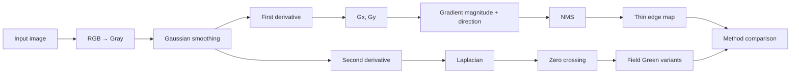
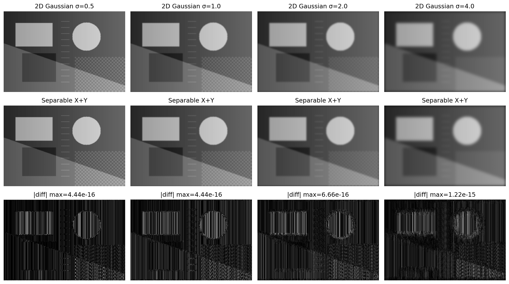
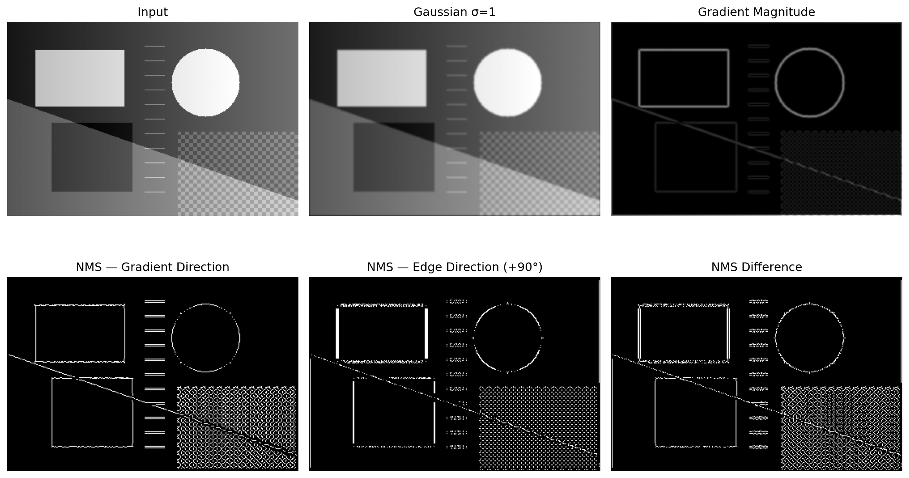
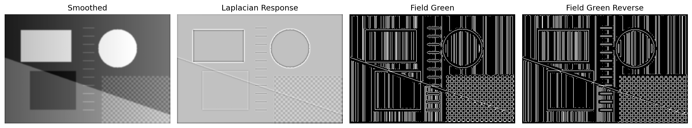
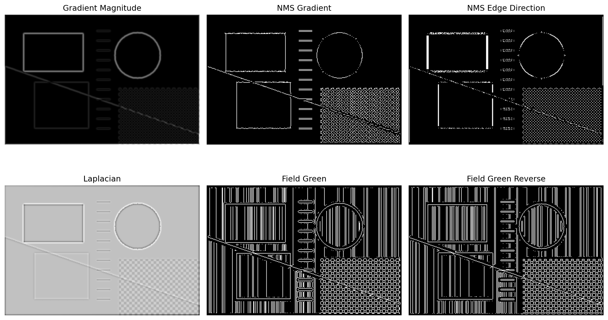
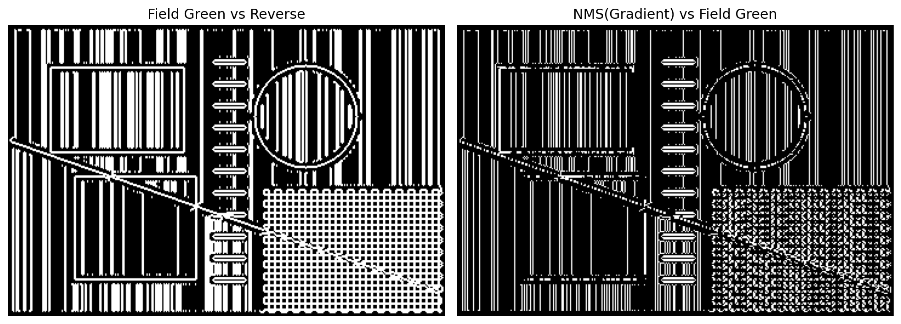
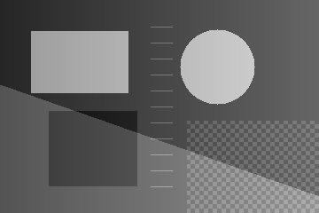

# Classical Image Processing from Scratch

A reproducible Python implementation of several foundational image-processing operations used in **digital photogrammetry and computer vision**:

- manual Gaussian smoothing
- 2D vs. separable Gaussian filtering
- first-derivative gradients
- Sobel-like edge operators
- Non-Maximum Suppression (NMS)
- second-derivative Laplacian filtering
- zero-crossing edge detection
- the two coursework “Field Green” zero-crossing variants
- direct comparison of first- and second-derivative edge representations

This repository originated from a graduate **Digital Photogrammetry** project at K. N. Toosi University of Technology.

## Why This Project?

The goal is not simply to call high-level functions such as `cv2.GaussianBlur()` or `cv2.Canny()`.

Instead, the project exposes the underlying operations:



## 1. Gaussian Smoothing

The Gaussian kernel is generated directly from:

```text
G(x,y) = exp(-(x²+y²)/(2σ²))
```

and normalized so that its coefficients sum to one.

The public implementation avoids ready-made convolution functions and performs convolution from NumPy sliding windows.

The project compares:

- a full 2D Gaussian convolution
- a separable 1D-X followed by 1D-Y Gaussian convolution

for:

```text
σ = 0.5, 1.0, 2.0, 4.0
```

Because a Gaussian is separable, the two outputs should be numerically equivalent.



## 2. First-Derivative Edge Detection

The project uses manually defined Sobel-like kernels:

```text
Kx = [-1  0  1]      Ky = [-1 -2 -1]
     [-2  0  2]           [ 0  0  0]
     [-1  0  1]           [ 1  2  1]
```

Then:

```text
M = sqrt(Gx² + Gy²)
theta = atan2(Gy, Gx)
```

Two NMS variants are evaluated:

1. **Gradient-direction NMS** — the standard formulation.
2. **Edge-direction NMS** — a +90° coursework comparison.

The original report found that gradient-direction NMS produced cleaner and more stable thin edges.



## 3. Second-Derivative Edge Detection

The Laplacian operator is:

```text
[ 0  1  0]
[ 1 -4  1]
[ 0  1  0]
```

After Gaussian smoothing, the Laplacian response is converted to binary edges with the two zero-crossing rules used in the coursework:

### Field Green

A pixel is selected when:

- the center is positive
- at least one 4-connected neighbor is negative

### Reverse Field Green

A pixel is selected when:

- the center is negative
- at least one 4-connected neighbor is positive



## 4. Direct Method Comparison

The original comparison script read previously rendered PNG figures back from disk.

That can contaminate numerical comparisons because plot titles, borders, scaling, and rendered backgrounds become part of the pixel data.

The public refactor fixes this by comparing the **raw numerical arrays directly**.





## Synthetic Reproducibility Demo

The original coursework used a natural landscape image.

To keep this public repository reproducible without redistributing an image of unknown licensing status, the repository ships a programmatically generated synthetic test image containing:

- strong step edges
- a circular object
- diagonal boundaries
- thin structures
- fine repeated texture
- smooth intensity variation



Generate all figures with:

```bash
python examples/synthetic_demo.py
```

## Run on Your Own Image

```bash
python examples/run_on_image.py path/to/image.jpg
```

Optional parameters:

```bash
python examples/run_on_image.py image.jpg \
  --downsample 4 \
  --sigma 1.0 \
  --threshold-ratio 0.15 \
  --output result.png
```

## Repository Structure

```text
classical-image-processing-from-scratch/
├── README.md
├── LICENSE
├── requirements.txt
├── .gitignore
├── src/
│   └── classical_image_processing/
│       ├── __init__.py
│       ├── io_utils.py
│       ├── gaussian.py
│       ├── first_derivative.py
│       ├── second_derivative.py
│       └── pipeline.py
├── examples/
│   ├── synthetic_demo.py
│   └── run_on_image.py
├── tests/
│   ├── test_gaussian.py
│   ├── test_edges.py
│   └── test_pipeline.py
├── docs/
│   └── coursework_provenance.md
└── figures/
    ├── synthetic_input.png
    ├── gaussian_2d_vs_separable.png
    ├── first_derivative_pipeline.png
    ├── second_derivative_pipeline.png
    ├── all_methods_grid.png
    └── difference_summary.png
```

## Installation

```bash
git clone https://github.com/Reza-pourali/classical-image-processing-from-scratch.git
cd classical-image-processing-from-scratch
pip install -r requirements.txt
```

## Testing

Run:

```bash
python -m unittest discover -s tests
```

The tests verify:

- Gaussian kernel normalization
- numerical equivalence of full 2D and separable Gaussian filtering
- NMS behavior
- relative thresholding
- the two zero-crossing rules
- end-to-end array-shape consistency

## Corrections Made Before Publication

The public version preserves the coursework concepts but fixes several repository-quality issues:

1. removes hard-coded Windows paths;
2. reconstructs the missing Gaussian chapter from the submitted report;
3. keeps the report's manual-kernel / manual-convolution intent;
4. uses raw arrays instead of rendered PNG screenshots for method comparison;
5. modularizes Gaussian, first-derivative, second-derivative, and pipeline code;
6. adds input validation, tests, CLI examples, and reproducible figures;
7. avoids redistributing the original landscape photo because its public-use license was not established.

## Scope

This repository is a cleaned academic implementation of foundational classical image-processing methods.

It is not intended to replace optimized production libraries. The emphasis is on understanding and reproducing the mathematics behind the filters and edge detectors.

## Research Relevance

This project demonstrates experience with:

- digital image processing
- Gaussian kernels and convolution
- separable filtering
- first- and second-order derivatives
- gradient magnitude and orientation
- edge thinning with NMS
- Laplacian filtering
- zero-crossing edge detection
- numerical validation
- classical computer vision

It complements my broader interests in **3D computer vision, point clouds, deep learning, and photogrammetry**.

## Academic Context

Graduate coursework in **Digital Photogrammetry**  
K. N. Toosi University of Technology

## Author

**Reza Pourali**  
M.Sc. Student in Photogrammetry  
K. N. Toosi University of Technology
